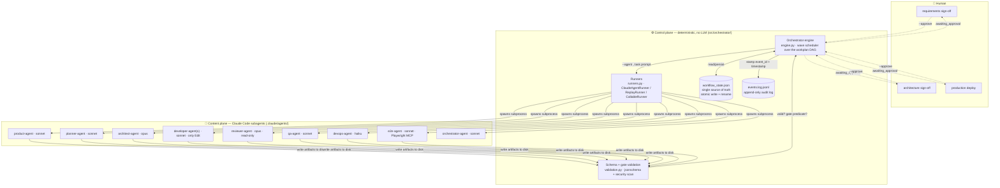
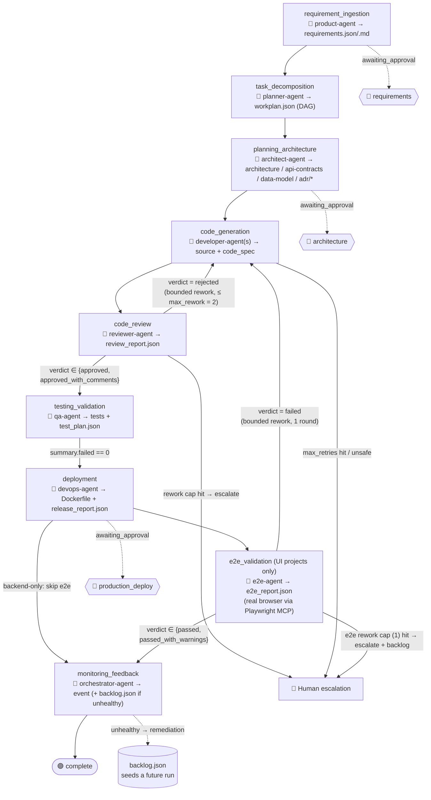
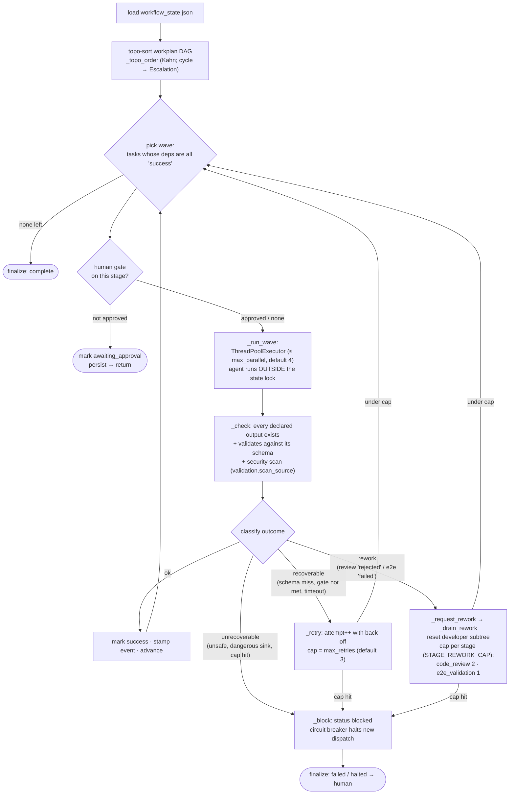
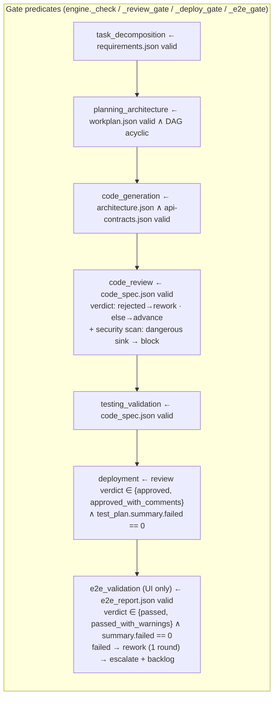
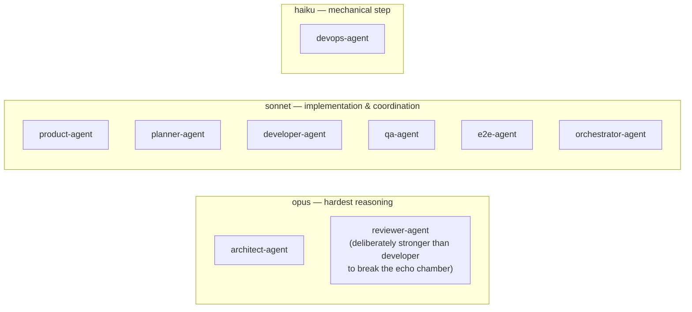

# Architecture Diagram — Agentic SDLC & Software Factory

> Final deliverable #2 (hackathon brief: *"Architecture diagram of the agent ecosystem"*).
> Every box and edge below traces to code. Authoritative sources: `SPEC.md`,
> `src/orchestrator/engine.py`, `src/orchestrator/validation.py`,
> `src/orchestrator/runners.py`, `.claude/agents/*.agent.md`, `schemas/*.json`.
> Where this prose and the code disagree, the code wins.

The system has two planes, deliberately separated (`SPEC.md §2`, §8):

- **Control plane** — the deterministic orchestrator. Owns flow, state, gates,
  retries, escalation. Never authors artifact content. Pure code, no LLM.
- **Content plane** — nine role-specialized Claude Code subagents. Each owns the
  content of its stage's artifacts and nothing else.

---

## 1. Agent ecosystem (control plane ↔ content plane)



**Why separate planes (`SPEC.md §8`):** the orchestrator cannot be talked out of a
gate by an agent's prose — validation and gate predicates are evaluated *mechanically*
(`validation.py`), and the orchestrator (not the agent) stamps `event_id` + `timestamp`
so the audit log cannot be fabricated (`engine.py` `_event`).

---

## 2. Lifecycle pipeline + control flow

Stage keys are exactly those in `workflow_state.json` (`STAGE_SEQUENCE`, `engine.py:29`).



The three linear pre-DAG stages (product → planner → architect) are modeled as a
synthetic prelude chain (`PRELUDE_TASKS`, `engine.py:75`); everything from
`code_generation` on is scheduled from the `workplan.json` `depends_on` DAG.
`e2e_validation` is appended **only for projects with a browser UI** (backend-only
projects skip it); for full-stack apps the `devops-agent` serves the built UI on the
**same origin** as the API so the deploy is browsable on a single URL (`SPEC.md §3.7`).
The `e2e-agent` then drives that URL in a real browser via the **Playwright MCP** server
(`@playwright/mcp`, declared in `.mcp.json`; `mcp__playwright__*` tools granted to the
e2e-agent in `.claude/settings.json`), maps each browser-facing acceptance criterion to a
scenario, de-flakes (retries up to 2× before failing), screenshots each, and writes
`e2e_report.json` (`SPEC.md §3.8`).

**Human checkpoints** (`HUMAN_GATES`, `engine.py:57`) — three mandatory gates the
engine blocks on as `awaiting_approval` states and resumes from on `--approve`:

| Gate key | Blocks before | Source |
|----------|---------------|--------|
| `requirements` | planner runs | `engine.py` `_gate_pause` |
| `architecture` | first developer task | `engine.py` `_gate_pause` |
| `production_deploy` | devops runs | `engine.py` `_gate_pause` |

`--yes` auto-approves all three for an unattended run.

---

## 3. The orchestrator control loop (engine.py)



Key functions (all in `src/orchestrator/engine.py`):

| Concern | Function | Line |
|---------|----------|------|
| Main wave scheduler | `run` | 379 |
| Concurrent wave execution | `_run_wave` | 450 |
| Single-task retry/rework/escalate | `_run_task` | 489 |
| Retry with back-off | `_retry` | 551 |
| Block + circuit breaker | `_block` | 565 |
| Bounded review/e2e→fix loop | `_request_rework` / `_drain_rework` / `_apply_rework` | 578 / 603 / 611 |
| Post-run schema + gate validation | `_check` | 680 |
| Review verdict gate | `_review_gate` | 712 |
| Deployment gate | `_deploy_gate` | 744 |
| E2E (browser) gate | `_e2e_gate` | 770 |
| Post-deploy feedback fold | `_monitor` | 806 |
| Human checkpoint block | `_gate_pause` | 466 |
| Topological sort / cycle detect | `_topo_order` | 282 |
| Atomic state persist | `_persist` | 173 |
| Event stamping | `_event` | 184 |

**Determinism guarantees (`SPEC.md §8`):** state is persisted with write-temp +
atomic rename (`_persist`); the slow agent subprocess runs *outside* the `self._lock`
so independent tasks genuinely parallelize while state mutation, persistence, and event
appends stay serialized; retries are keyed by `task_id` + `attempt` so a retry never
double-applies side effects (`SPEC.md §8.4`).

---

## 4. Stage gates (deterministic predicates)

Evaluated by code, never by judgment (`SPEC.md §7`, `validation.py`, `engine.py`).



**Security baseline is two-tier** (`validation.py` `_DANGEROUS`, `scan_source`):
code-execution / injection / secret sinks (`eval`, `exec`, `os.system`,
`subprocess(..., shell=True)`, `child_process`, hard-coded secrets) are an
**unrecoverable block**; XSS-prone-but-often-legitimate DOM sinks (`innerHTML`,
`document.write`) are surfaced as **non-blocking warnings** (`SPEC.md §9`). The scan
runs at the `code_review` gate (`engine.py:696`).

---

## 5. Artifacts & schemas (the contracts between agents)

The source of truth is the artifact files + event log, **not** chat history
(`SPEC.md §5`). Every artifact is `spec_version: "v1"` and schema-validated before the
next stage runs; where a `.json`/`.md` pair exists, the **JSON is authoritative**.

| Stage | Owner (model) | Output artifact(s) | Schema |
|-------|---------------|--------------------|--------|
| requirement_ingestion | product-agent (sonnet) | `requirements.json` + `.md` | `requirements.schema.json` |
| task_decomposition | planner-agent (sonnet) | `workplan.json` | `workplan.schema.json` |
| planning_architecture | architect-agent (opus) | `architecture.json` | `architecture.schema.json` |
| planning_architecture | architect-agent (opus) | `api-contracts.json` (OpenAPI 3.x) | `api-contracts.schema.json` |
| planning_architecture | architect-agent (opus) | `data-model.json` | `data-model.schema.json` |
| planning_architecture | architect-agent (opus) | `adr/ADR-NNN-*.json` | `adr.schema.json` |
| code_generation | developer-agent (sonnet) | source + `code_spec.json` (or `code_spec/<task_id>.json`) | `code_spec.schema.json` |
| code_review | reviewer-agent (opus) | `review_report.json` | `review_report.schema.json` |
| testing_validation | qa-agent (sonnet) | tests + `test_plan.json` | `test_plan.schema.json` |
| deployment | devops-agent (haiku) | `Dockerfile` + `release_report.json` | `release_report.schema.json` |
| e2e_validation *(UI only)* | e2e-agent (sonnet) | `e2e_report.json` (+ `e2e-screens/*.png`) | `e2e_report.schema.json` |
| (all) | orchestrator-agent | `workflow_state.json` | `workflow_state.schema.json` |
| (all, append-only) | every agent | `events.log.jsonl` | `event.schema.json` |

Schema resolution (incl. `adr/*` and per-task `code_spec/*`) is in
`validation.py` `schema_for_output`.

---

## 6. Model & privilege strategy (per role, not global)

Pinned in each agent's frontmatter so cost cannot silently regress (`SPEC.md §4`).



**Least privilege** (tool lists in `.claude/agents/*.agent.md`): only `developer-agent`
keeps `Edit` (it patches existing code); authoring agents (`product`, `planner`,
`architect`) have no `Bash`; `reviewer-agent` has neither `Bash` nor `Edit` — read +
report only; `e2e-agent` has no `Edit`/`Bash` either — only `Read/Write/Glob/Grep` plus
the `mcp__playwright__browser_*` tools (it drives a browser against the deployed URL,
never the code). `--model` overrides every agent for a single run when needed.

---

## 7. Runners — how a task becomes an agent invocation

`src/orchestrator/runners.py` decouples the engine from *how* a task is fulfilled:

- **`ClaudeAgentRunner`** (default, live) — spawns `claude -p <prompt> --agent <role>
  --output-format stream-json …` as a subprocess in the project dir, with a watchdog
  timeout (default 1800 s → recoverable), streams a compact trace to
  `agent-trace/<task_id>.jsonl`, and returns the result envelope (carrying cost/token
  metrics) while the **on-disk artifacts remain authoritative**.
- **`ReplayRunner`** — reuses outputs already on disk to resume / re-validate a run with
  no LLM cost (idempotency, `SPEC.md §8.4`). Backs `--replay`.
- **`CallableRunner`** — adapts a plain `fn(task, project_root)` for deterministic
  in-process tests (the control plane is exercised without any LLM).

Errors are classified at this boundary: `RecoverableError` (retry with back-off) vs
`UnrecoverableError` (block + escalate immediately).

---

## 8. Observability

`workflow_state.json` holds live per-stage/per-task status; `events.log.jsonl` is the
append-only audit trail (`event_id`, `workflow_id`, `stage`, `agent`, `status`,
`input_refs`, `output_refs`, `summary`, `blocking_issues`, `retry_count`, `timestamp`,
optional `metrics`). The zero-dependency dashboard (`observability/`, served via
`./observability/serve.sh <project>`) reads both and renders live progress. State is
reconstructable by folding the event log (`SPEC.md §8.1`).

---

## 9. Reference — end-to-end data flow (one task)

```
workplan task ──▶ engine picks it when deps are 'success'
              ──▶ human gate? block as awaiting_approval until --approve
              ──▶ ClaudeAgentRunner spawns `claude --agent <role>` (outside state lock)
              ──▶ agent writes artifacts to projects/<name>/artifacts/…
              ──▶ engine._check: schema-validate every output + run stage gate + security scan
                    ok            → mark success, stamp event, persist, advance
                    recoverable   → _retry (attempt++, back-off) up to max_retries
                    rework        → _request_rework: reset developer subtree up to max_rework
                    unrecoverable → _block, circuit breaker halts new dispatch → human
              ──▶ atomically persist workflow_state.json → next wave
```

See also: `LIFECYCLE-MAP`-style prose in `SPEC.md §3`, the existing flow sketch in
`.claude/docs/workflow/mermaid.md`, and the requirement-to-evidence mapping in
`REQUIREMENTS-TRACEABILITY.md`.
